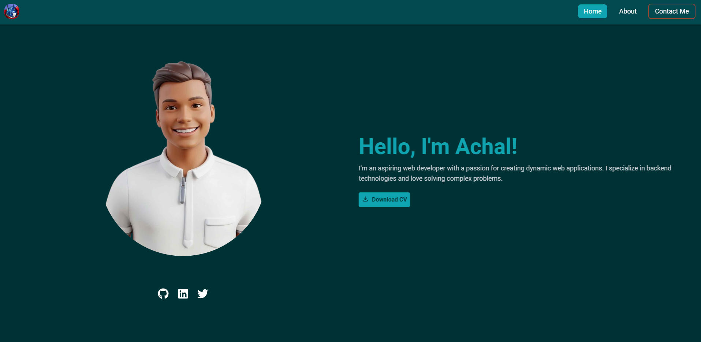
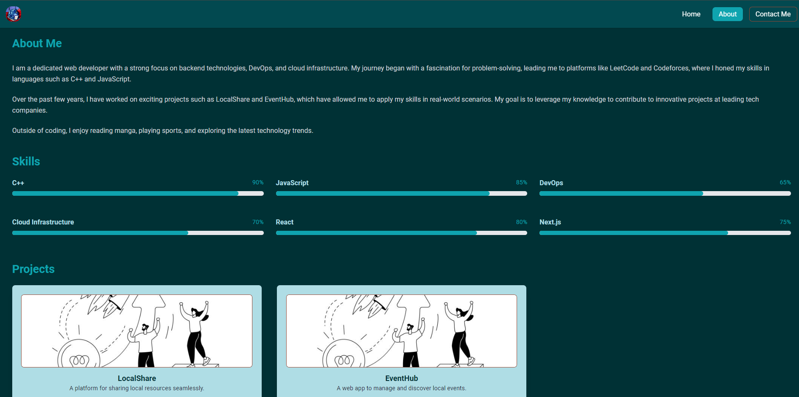
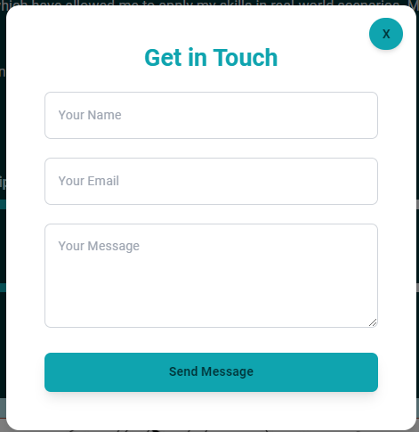

# React Portfolio

This is a responsive and modern portfolio website built with React and Vite, featuring smooth animations using Framer Motion and styled with Tailwind CSS. It showcases different sections such as About, Projects, and Contact, with a contact form integrated using Formspree for direct email submissions.

## Live Demo

The site is live and can be viewed here:
[React Portfolio - Live Site](https://react-portfoli-btech004.netlify.app/)

## Home Page Preview

 

## Features

- **Responsive Design**: Fully responsive across all devices.
- **Smooth Animations**: Powered by Framer Motion for fluid transitions.
- **Contact Form**: Integrated with Formspree for direct email submissions.
- **React Router**: Efficient navigation between different pages and sections.
- **Tailwind CSS**: Fast and modern styling.
- **React Icons**: Used for beautiful and scalable icons.

## Technologies Used

- **React**: Front-end framework for building user interfaces.
- **Vite**: Lightning-fast build tool.
- **Framer Motion**: Used for animations and interactions.
- **Tailwind CSS**: Utility-first CSS framework for responsive design.
- **React Router**: For routing between pages.
- **Formspree**: For handling contact form submissions without writing a backend.

## Getting Started

Follow these steps to run the project locally:

### Prerequisites

Make sure you have Node.js and npm installed on your machine.

- [Download Node.js](https://nodejs.org/)

### Installation

1. Clone this repository:
   ```bash
   git clone https://github.com/your-username/react-portfolio.git
   cd react-portfolio
   ```
2. Install dependencies:
    ```bash
    npm install
    ```
3. Run the development server:
    ```bash
    npm run dev
    ```
4. Open your browser and go to:
http://localhost:5173

## Contact Form
The contact form is powered by Formspree. You can test it on the live site or add your own Formspree URL if you fork this project.

## Screenshots
### About Section

 
### Contact Section

 

# Conclusion
Thank you for checking out this React Portfolio! I hope it serves as a useful resource for showcasing projects and connecting with others. 

